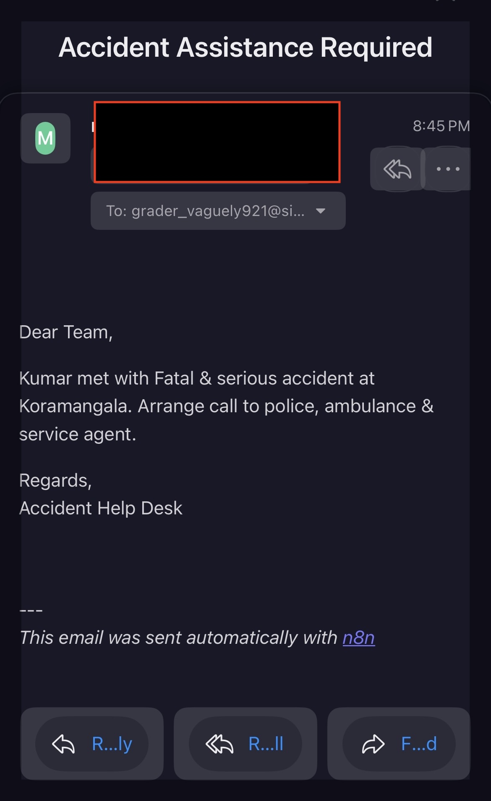

#AccidentAssist :This project is an AI-driven workflow and data processing system 🤖 that automates tasks, enables real-time decision-making ⏱️, and provides interactive visualizations 📊. It integrates n8n ⚙️ for workflow automation, Streamlit 🌐 for dashboards, LangGraph 🔗 for state management, HuggingFace 🧠 for NLP, and PyTorch 🔥 for deep learning. The modular architecture ensures seamless data flow ➡️, real-time AI inference ⚡, and scalable design 📈. Key outcomes include improved workflow efficiency ✅, AI-powered insights 💡, and a foundation for future enhancements 🚀.
# AccidentAssist — Intelligent Accident Response

When an accident happens, most customers panic and don’t know the next step: call police, ambulance, fire, insurer, or a relative? **AccidentAssist** solves this confusion with an **agentic multi-agent system** that automates triage, dispatch, and communication.

---

## 🚗 Problem
- Lack of clarity on whom to call first.
- Delay in arranging towing, repairs, and notifying key contacts.
- No real-time updates for customers.

---

## ✅ Solution
An **Agentic-powered orchestration system** where different agents handle specific roles:

- **RM Agent**: Collects info, location, runs “drivable?” check.
- **Tow Agent**: Dispatches tow truck if not drivable, updates status.
- **Service Station Agent**: Registers case, notifies customer & RM.
- **Notifier**: Sends updates via **Email / SMS / WhatsApp** at every stage.

---

## 🗺️ Flow

### Agent Responsibilities
- **RM Agent**  
  1. Get location info  
  2. Run `drivable()` → If N → Tow Agent | If Y → Service Station Agent  

- **Tow Agent**  
  1. Get location  
  2. Tow to service station  
  3. Update RM Agent  

- **Service Station Agent**  
  1. Register case  
  2. Notify customer & RM  

---

## 🔔 Customer Updates
At each stage, customers are informed automatically:
- Accident reported  
- Tow assigned & en route  
- Vehicle at workshop  
- Diagnosis & estimate ready  
- Repair complete  

---

## ⚠️ Emergency Note
This system **does not replace emergency services**.  
If injuries or fire occur, **call 112 (India)** or the relevant local emergency number immediately.

---

**AccidentAssist** = the right help, at the right time, with real-time transparency.
This is how user get notified:

